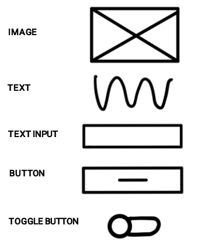
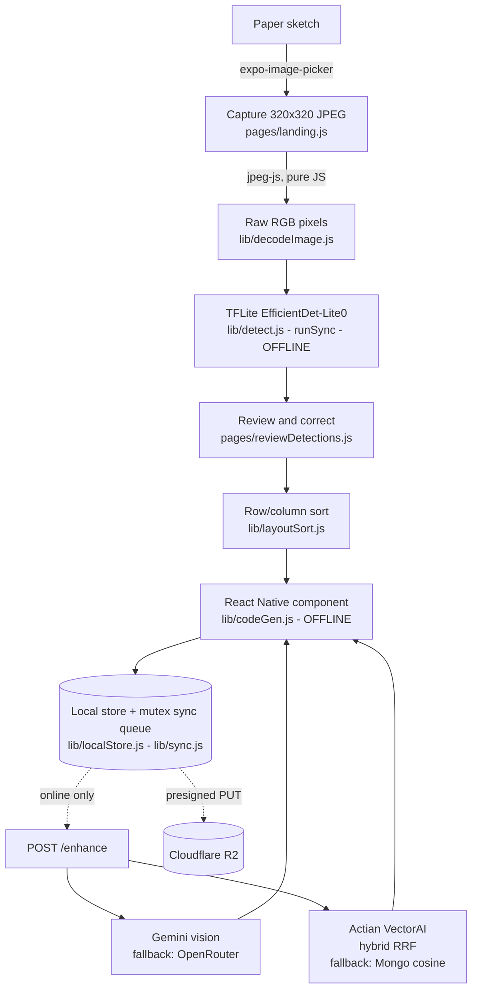

<h1 align="center">AutoReact.ai</h1>

<p align="center">
  <b>Photograph a paper wireframe. Get runnable React Native code. On a plane, with the wifi off.</b>
</p>

<p align="center">
  Android (Expo dev-client) &middot; EfficientDet-Lite0 on-device &middot; 5 element classes &middot; optional online Enhance
</p>

---

<!--
JUDGES-FIRST TODO - the single highest-value thing still missing from this repo.
Record 15-20s of the real flow (sketch -> capture -> review -> code) in airplane
mode, save it as docs/demo.gif, then uncomment the block below and delete this one.
Add three stills too: the paper sketch, the review screen with its colored marks,
the generated code screen.

<p align="center">
  
</p>
-->

## The 60-second version

You sketch a screen on paper. You photograph it. An EfficientDet-Lite0 model **running on the
phone** finds the five element types (text, text field, button, image, switch). You tap any box
the model got wrong to fix its class, or delete it. The app sorts the corrected boxes into rows
and emits a real React Native component — **all of it with the radio off**.

If you happen to have a connection, an optional **Enhance** pass reads the handwriting, writes
real copy in place of placeholders, and picks a theme — matched against a design-pattern library
through **Actian VectorAI hybrid fusion search**. Enhance is never on the critical path: no
signal, no API key, no sponsor service, still a working app.

## The sketch language

Five marks, learnable in about ten seconds. This sheet ships in the app
(`auto-layout/assets/guidelines.png`) and is what the detector was trained on:

<p align="center">
  
</p>

## Why this is not just an API call to a vision model

| | |
|---|---|
| **The core loop never touches a network.** | Detection is a TFLite file executed by `react-native-fast-tflite`; codegen is pure string templating. Airplane mode *is* the demo. |
| **The user corrects the model, not the other way round.** | `pages/reviewDetections.js` sits between capture and codegen. Tap a box to cycle its class, &times; to drop a false positive, Undo to restore. Corrections are posted to `/corrections` for a future retrain. |
| **The RAG lookup is hybrid, not nearest-neighbor.** | Actian VectorAI ranks patterns twice — once by semantics, once filtered to the sketch's actual detected element types — and fuses the two lists with Reciprocal Rank Fusion. Details below. |
| **Every remote dependency has a fallback that was actually written.** | Gemini &rarr; OpenRouter (Claude 3 Haiku + `text-embedding-3-small`). Actian &rarr; in-Mongo cosine similarity, identical signature. Offline &rarr; Enhance skips itself silently. |
| **The dataset is ours.** | ~350 hand-drawn sketches, photographed and labeled by hand in Pascal VOC, plus a seeded augmentation pipeline aimed at the failure modes our stress harness found. |

## Architecture



Everything above the dotted edges runs with no connection. Below them is optional polish.

## Actian VectorAI: what we actually built on it

`server/src/lib/actian.js`, called from `server/src/routes/enhance.js`.

A plain vector search over a layout description returns patterns that *sound* similar. On its own
that is the wrong signal — "a login screen" and "a settings screen" describe alike and are built
from completely different elements. So we run two searches and fuse them:

1. **Semantic** — embed `describeLayout(predictions)` (free text) and rank the pattern library by
   vector similarity.
2. **Structured** — the same vector search, filtered to patterns tagged with the element types the
   detector actually found (`tagsFromPredictions`).
3. **Fuse** — the SDK's `reciprocalRankFusion` merges the two ranked lists into one.

A pattern that is both semantically close *and* assembled from the same kinds of elements
outranks one that only matches on prose. The winner feeds the same `codeGen.generateCode()` the
offline path uses, through a `theme` option — enhanced and offline output share one code path, so
Enhance can never emit code the offline path couldn't.

If Actian is unreachable, `server/src/lib/cosineFallback.js` is a drop-in with identical
signatures (`upsertPattern` / `findClosestPattern`) doing cosine similarity in Mongo. Swap one
`require` and the demo still runs — just without the hybrid ranking.

> Deployment note worth knowing: `ACTIAN_CONNECTION_STRING` must be the compose service name
> (`actian:6574`), never `localhost:6574` — `api` and `actian` are separate containers with
> separate network namespaces. We shipped that bug for a while and silently fell back to cosine.
> Fixed, and written down here so nobody repeats it.

## The model

| | |
|---|---|
| Architecture | EfficientDet-Lite0 via TFLite Model Maker |
| Classes | `text`, `text_input`, `button`, `image`, `switch` (ids 1-5, `model/auto-layout/label_map.pbtxt`) |
| Data | 342 labeled train pairs + 10 held-out eval pairs, hand-drawn and hand-labeled (Pascal VOC) |
| Training | 20 epochs, batch 4, whole model |
| Eval | **AP50 = 1.0, overall AP = 0.73** |
| Input | `uint8 [1, 320, 320, 3]` — no normalization |
| Output order | `[scores, boxes, count, classes]` — **not** the classic SSD order |

That last row cost real debugging time. Model Maker's export does not use the
`[boxes, classes, scores, count]` convention nearly every tutorial assumes. We confirmed the real
order by inspecting raw tensor values rather than guessing, and every script in `model/` now
identifies each output tensor **by shape and value signature instead of a hardcoded index** — so a
retrain that shuffles the order breaks nothing.

### Reproduce it

```bash
cd model

python augment_dataset.py --per-image 4   # seeded; originals + variants -> training_images_aug
python train_tflite.py                    # conda env al_train -> ../auto-layout/assets/model/detector.tflite
python verify_tflite.py                   # tensor shapes + detections on 5 held-out images
python eval_tflite.py --thr 0.3,0.5       # P/R/F1 at IoU 0.5, across three preprocessing modes
python stress_tflite.py                   # dim / blurred / noisy / small-in-frame robustness
```

GPU training runs in Docker — native Windows TensorFlow lost GPU support after 2.10, and Model
Maker 0.3.4 needs Python 3.9 or older:

```bash
docker build -t autoreact-train - < model/Dockerfile.train
docker run --rm --gpus all -v "$PWD/model:/work" autoreact-train
# env knobs: TRAIN_DIR  EVAL_DIR  EPOCHS(40)  BATCH(8)  OUT(candidates/detector_aug.tflite)
```

GPU runs write to `candidates/` and never overwrite the shipped `detector.tflite` — a candidate is
adopted only after `eval_tflite.py` and `stress_tflite.py` say it is better.

`eval_tflite.py` exists because preprocessing has to match between training and the app: it scores
`squash` (resize, ignore aspect), `pad_tl` (letterbox, top-left) and `pad_c` (centered letterbox)
against the same labels, so the app's choice is a measurement rather than a guess.
`stress_tflite.py` perturbs the eval set the way a real phone photo differs from our
single-session training shoot — dim light, blur, JPEG artifacts, sketch small in frame — and its
output is exactly what `augment_dataset.py` targets.

## Run it

```bash
# Mobile — needs a dev-client build; the TFLite module is native
cd auto-layout
npm install
cp .env.example .env          # EXPO_PUBLIC_API_URL -> your server (inlined at BUILD time)
eas build --profile development --platform android
npx expo start --dev-client

# Server
cd server
npm install
cp .env.example .env          # Mongo / R2 / Gemini / OpenRouter / Actian
npm run selfcheck             # routing + middleware, no live services needed
node scripts/seedPatterns.js  # seeds the RAG pattern library (needs Mongo + a Gemini key)
npm start
# or, bringing Actian up alongside the API:
docker compose up -d --build  # run from inside server/ — it builds from the repo root
```

Credentials, deploy steps and device notes in full: **[`RUNBOOK.md`](RUNBOOK.md)**.

## Honest status

What we verified and what we did not — a declared gap beats a surprise during a demo.

| Verified | How |
|---|---|
| Model accuracy | AP50 = 1.0, AP = 0.73 on held-out images (`verify_tflite.py`, `eval_tflite.py`) |
| Output tensor order | Read off the real export, not assumed; scripts auto-detect it now |
| Offline core loop | Detection and codegen make zero network calls, by construction |
| Server routing | `npm run selfcheck`, no live services required |
| Enhance degradation | Gemini&rarr;OpenRouter and Actian&rarr;cosine fallbacks both written and wired |

| Not yet verified on hardware | Why it matters |
|---|---|
| `react-native-fast-tflite` output index order | Near-certain to match Python's, but log `outputs.map(o => o.length)` on the first device run — expect `[25], [100], [1], [25]` |
| `jpeg-js` decode inside Hermes | Tested under plain Node only; pure JS with no native deps, but confirm early |
| Actian wire protocol | `actian.js` was written against a speculative REST shape — keep the function signatures if you rewrite the internals |
| iOS | Android only so far (`com.gamerdas.aicodegen`) |

Known gaps: corrections are collected but nothing retrains on them yet; the dark scheme needs
`expo-system-ui` installed to take effect natively; no device screenshots captured yet.

## Repo map

| Path | What |
|---|---|
| `auto-layout/` | Expo / React Native app — capture, on-device detection, review, offline codegen. No UI library; a small design system in `theme/tokens.js` + `components/`. |
| `server/` | Express + MongoDB + Cloudflare R2 + JWT. Auth, sketch CRUD, presigned uploads, `/enhance`. |
| `model/` | Dataset (~350 labeled sketches) and the full training / augmentation / eval / stress pipeline. |

## Docs

| Doc | Read it for |
|---|---|
| [`token.md`](token.md) | The complete technical walkthrough — every step, every file, every design decision and the reason behind it |
| [`RUNBOOK.md`](RUNBOOK.md) | Setup, credentials, deploy, device testing, known gaps |
| [`DESIGN.md`](DESIGN.md) | The design system: "Proof Marks" — blue pencil taps, red pencil corrects, five class marks |
| [`PRODUCT.md`](PRODUCT.md) | Users, positioning, product principles |

## Roadmap

- Retrain on the collected `/corrections` — the data is already being captured.
- Adopt the augmented-data GPU candidate once it beats the shipped model on the stress set.
- iOS dev-client build.
- Nested containers in codegen (the structure is flat rows and columns today).

## License

See [`LICENSE`](LICENSE).

## Contributing

Open an issue first for anything nontrivial, so we can agree on the approach before you spend time
on a PR.
